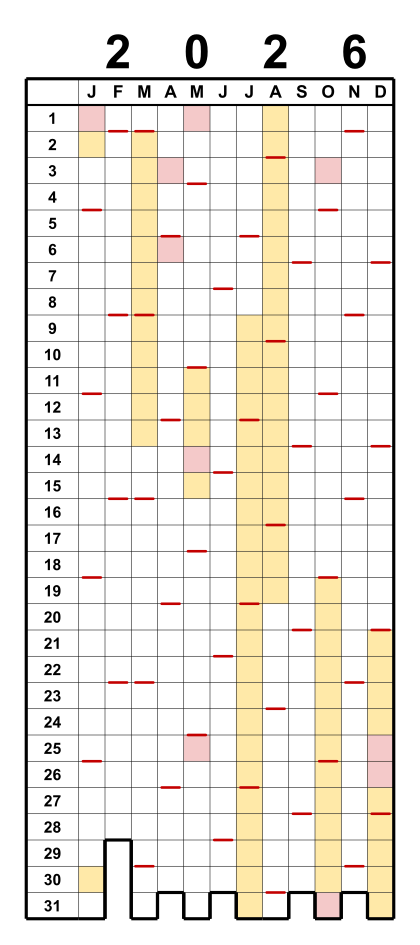
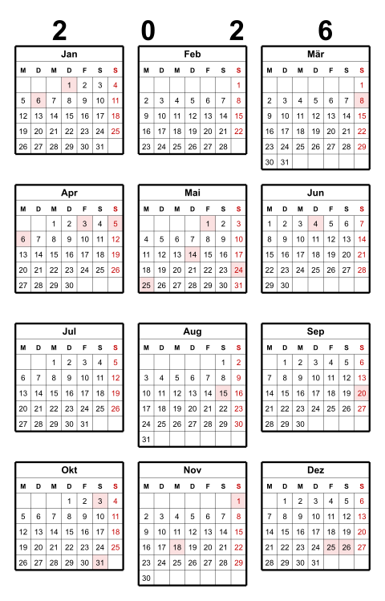
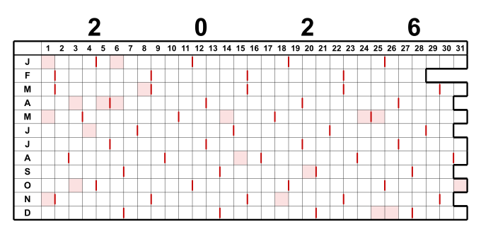

# Pixel Year

🌐 [English](README.md) · **Deutsch** · [Español](README.es.md) · [Français](README.fr.md) · [Italiano](README.it.md) · [日本語](README.ja.md)

▶️ **[Live ausprobieren](https://theingof.github.io/pixel-year/)** — läuft im Browser, ohne Installation.

🖥️ **App-Oberfläche** in 27 Sprachen: 🇪🇺 alle EU-Sprachen · 🇳🇴 · 🇯🇵

> **Idea 100% human · Code 95% LLM**

*Jahreskalender als Gitter — „Year in Pixels".*

Spalten = Monate (J–D), Zeilen = Tage 1–31. Die Kästchen werden ausgemalt — ein
klassisches „Year in Pixels". Ein farbiger Strich markiert jeden Sonntag; die untere
Stufenkontur folgt den real existierenden Tagen jedes Monats. Optional lassen sich
Feiertage und Schulferien einfärben. Die Ausgabe ist maßstabsgetreu in Millimetern
(Kästchen 5 × 5 mm).

> Persönliches Hobbyprojekt. Ohne Gewähr, ohne Support-Garantie.

### Wofür ist das?

Pixel Year ist ein leeres „Year in Pixels"-Gitter — ein kleines Kästchen pro Tag — das du von
Hand ausfüllst (oder vorab mit Feiertagen und Schulferien einfärbst). Ein Blatt zeigt das ganze
Jahr auf einen Blick. Beliebte Einsatzzwecke:

- **Stimmungstracker** — jeden Tag nach Gefühl einfärben; das Jahr nimmt Gestalt an.
- **Gewohnheits-Tracker** — markiere jeden Tag mit Sport, Meditation, Übung, ohne Alkohol …
- **Reise- / „Wo war ich"-Log** — Tage nach Ort oder Reise einfärben.
- **Urlaubs- & Abwesenheitsplaner** — alle freien Tage auf einmal sehen; mit zweitem Overlay
  zwei Länder/Personen vergleichen (Grenzregion, Familie im Ausland).
- **Serien & Ziele** — Lesen, Workouts, No-Spend-Tage, bildschirmfreie Tage.
- **Gesundheit / Zyklus / Schlaf** — eine Farbe pro Zustand.

Bei 100 % ausdrucken und ins Notizbuch kleben oder an die Wand hängen — oder die SVG/PDF in
einer Zeichen-/Handschrift-App auf dem Tablet öffnen und mit dem Stift ausfüllen.

## Schnellstart

1. **`pixel-year.html`** herunterladen.
2. Per Doppelklick im Browser öffnen — Windows, macOS, Linux. Keine Installation.
3. Jahr und Optionen wählen, dann **SVG** oder **PDF** herunterladen
   (drei Kalender auf einer A4-quer-Seite).

Der Rest ist hoffentlich selbsterklärend.

Alles läuft offline im Browser. Nur die Schulferien werden online geladen
(OpenHolidays-API).

## Funktionen

- **Gitterkalender:** Spalten = Monate, Zeilen = Tage 1–31; die untere Stufenkontur
  folgt den gültigen Tagen jedes Monats (fehlende Tage wie der 30. Februar bleiben offen).
- **Layouts:** Pixel-Gitter (hoch / quer) und Monats-Matrix (3×4 / 4×3, echte
  Wochen-Mini-Kalender).
- **Sonntagsstriche** (oder ein beliebiger Wochentag) an der unteren Zellenkante.
- **Wochenbeginn** Montag oder Sonntag (Standard = landesüblich); Sonntage in Rot.
- Option **Jahreszahl ausblenden**.
- **Feiertage** (rot) und **Schulferien** (gelb) für **130+ Länder** weltweit
  (OpenHolidays & Nager.Date; Regionen und Schulferien wo verfügbar).
- **Ausgabe:** einzelne **SVG** oder ein maßstabsgetreues **A4-quer-PDF** mit drei
  Kalendern nebeneinander — direkt im Browser erzeugt, ohne Druckdialog,
  ohne Zusatzsoftware.
- **Maßstabstreue** 5-mm-Kästchen überall; Querformat-Kalender werden auf A4 gestapelt,
  eine einzelne Monats-Matrix passt auf A5/A6.
- **Anpassbar:** Kästchengröße, Farben (Sonntag / Feiertag / Ferien) und alle
  Strichstärken, mit Live-Vorschau.

## Layouts

Layout über das Menü **Layout** wählen:

- **Pixel-Gitter** — das klassische „Year in Pixels": Monate als Spalten, Tage 1–31 als
  Zeilen. Als **Hochformat** oder **Querformat** (transponiert: Tage als Spalten, Monate
  als Zeilen; im Druck untereinander auf A4 hoch).
- **Monats-Matrix (3×4 oder 4×3)** — zwölf echte Wochen-Mini-Kalender, eine druckbare
  Jahresübersicht. Ein einzelnes Jahr kommt auf das kleinste passende Format (**A5**, bei
  kleiner Zellgröße sogar **A6**); zwei Jahre passen auf ein A4.

  
  

## Drucken

Mit **100 % / „Tatsächliche Größe"** drucken (nicht „An Seite anpassen"), sonst stimmt
das 5-mm-Raster nicht mehr.

## Kommandozeilen-Tool (archiviert)

Ein Python-CLI erzeugte dieselben Kalender über die Befehlszeile (Stapelverarbeitung,
Skripte). Es liegt jetzt unter [`legacy/pixel_year.py`](legacy/pixel_year.py) und wird
**nicht mehr gepflegt** — die HTML ist die alleinige Quelle der Wahrheit. Das
Katalog-/Validierungs-Werkzeug [`tools/build_catalog.py`](tools/build_catalog.py) bleibt
im Einsatz.

## International

**Sprache**, **Land** und **Region** frei wählbar — z. B. ein Hamburg-Kalender mit
japanischer Beschriftung. Monats-/Tagesnamen lokalisiert in sechs UI-Sprachen
(EN, DE, ES, FR, IT, JA); der markierte Wochentag folgt der Landeskonvention, und für
Japanisch wird ein Wareki-Hinweis (和暦) angezeigt.

Die Feiertags- und Feriendaten stammen von den APIs **OpenHolidays** und **Nager.Date**. Wo es
für ein Land/eine Region keine Daten gibt — oder du eigene nutzen willst — wähle **# Eigene** in
der Länderliste und füge eigene Daten ein (Einzeltage oder Bereiche).

**Zwei Länder in einem Kalender** — für Grenzregion oder Urlaubsplanung lässt sich ein
zweites Land/Region überlagern. Überlappende Tage werden diagonal geteilt:

## Lizenz

GNU General Public License v3.0 — siehe [LICENSE](LICENSE).

## Zum LLM-Einsatz

Entstanden „human-in-the-loop" mit einem LLM (siehe Badge oben). Das geht mit wenigen Mitteln
im Standard-Tarif — keine Token-Verschwendung, sondern gezielte, klar umrissene Aufgaben, wenn
man weiß, was man will. Kein Big-Tech-Token-Verbrennen nötig. Die größte Verschwendung war das
27-Sprachen-Paket — aber das war es mir wert. ;)

---

> Spenden sind freiwillig und unterstützen ausschließlich das Projekt. Sie beeinflussen
> nicht die Priorisierung von Fehlern, Feature-Wünschen oder Support-Anfragen.
