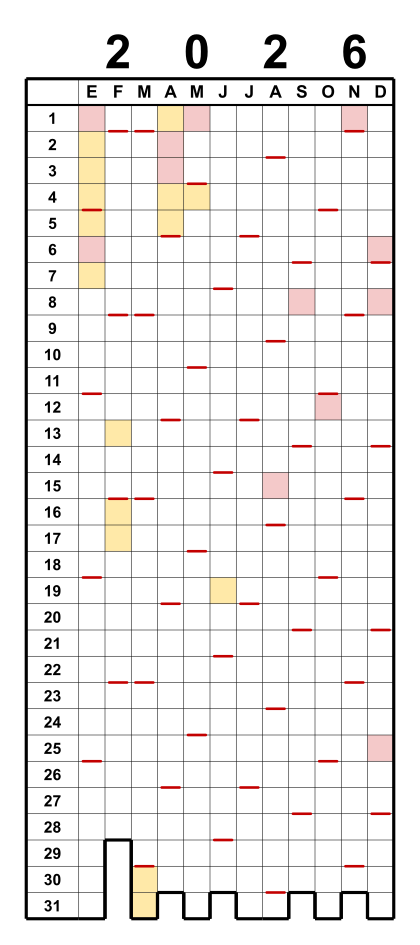

# Pixel Year

🌐 [English](README.md) · [Deutsch](README.de.md) · **Español** · [Français](README.fr.md) · [Italiano](README.it.md) · [日本語](README.ja.md)

🖥️ **Interfaz de la app** en 27 idiomas: 🇪🇺 todos los idiomas de la UE · 🇳🇴 · 🇯🇵

> **Idea 100% human · Code 95% LLM**

*Calendario anual en cuadrícula — “Year in Pixels”.*

Columnas = meses (E–D), filas = días 1–31. Se colorean las casillas — un clásico
“Year in Pixels”. Un trazo de color marca cada domingo; el contorno escalonado inferior
sigue los días reales de cada mes. Opcionalmente se pueden colorear los días festivos y
las vacaciones escolares. La salida es a escala, en milímetros (casillas de 5 × 5 mm).

> Proyecto personal y amateur. Se ofrece tal cual, sin garantías ni soporte.

## ¿Para qué sirve?

Pixel Year es una cuadrícula “Year in Pixels” en blanco — una casilla por día — que rellenas a
mano (o coloreas de antemano con festivos y vacaciones escolares). Una hoja muestra todo el año
de un vistazo. Usos habituales:

- **Registro de ánimo** — colorea cada día según cómo te sentiste; el año toma forma.
- **Seguidor de hábitos** — marca cada día con deporte, meditación, práctica, sin alcohol …
- **Diario de viajes / “dónde estuve”** — colorea los días por lugar o viaje.
- **Planificador de vacaciones y ausencias** — visualiza todos tus días libres a la vez; con una
  segunda capa, compara dos países/personas (zona fronteriza, familia en el extranjero).
- **Rachas y objetivos** — lectura, entrenamientos, días sin gastar, días sin pantalla.
- **Salud / ciclo / sueño** — un color por estado.

Imprímelo al 100 % para pegarlo en un cuaderno o colgarlo en la pared — o importa el SVG/PDF en
una app de dibujo / escritura a mano en la tablet y rellénalo con el lápiz óptico.

## Inicio rápido

1. Descarga **`pixel-year.html`**.
2. Haz doble clic para abrirlo en cualquier navegador — Windows, macOS, Linux.
   Sin instalación.
3. Elige el año y las opciones, y descarga el **SVG** o el **PDF**
   (tres calendarios en una hoja A4 horizontal).

El resto es, con suerte, autoexplicativo.

Todo funciona sin conexión en el navegador. Solo las vacaciones escolares se obtienen
en línea (API OpenHolidays).

## Funciones

- **Calendario en cuadrícula:** columnas = meses, filas = días 1–31; el contorno
  escalonado inferior sigue los días válidos de cada mes (los días inexistentes, como el
  30 de febrero, quedan abiertos).
- **Marcas de domingo** (o de cualquier día) en el borde inferior de la casilla.
- **Festivos oficiales** (rojo) y **vacaciones escolares** (amarillo) para **más de 130 países**
  (OpenHolidays y Nager.Date; regiones y vacaciones escolares según disponibilidad).
- **Salida:** un único **SVG**, o un **PDF A4 horizontal** a escala con tres calendarios
  uno al lado del otro — generado directamente en el navegador, sin diálogo de impresión,
  sin software adicional.
- **Personalizable:** tamaño de las casillas, colores (domingo / festivo / vacaciones) y
  todos los grosores de línea, con vista previa en vivo.

## Impresión

Imprime al **100 % / “Tamaño real”** (no “Ajustar a la página”), de lo contrario la
cuadrícula de 5 mm deja de coincidir.

## Herramienta de línea de comandos (archivada)

Un script de Python producía los mismos calendarios desde la línea de comandos (por lotes,
scripts). Ahora se encuentra en [`legacy/pixel_year.py`](legacy/pixel_year.py) y **ya no
recibe mantenimiento** — la herramienta HTML es la única fuente de verdad. La utilidad de
catálogo/validación [`tools/build_catalog.py`](tools/build_catalog.py) sigue en uso.

## Internacional

Elige **idioma**, **país** y **región** de forma independiente — p. ej. un calendario de
Hamburgo con etiquetas en japonés. Nombres de meses/días localizados en seis idiomas de
interfaz (EN, DE, ES, FR, IT, JA); el día marcado sigue la convención del país y, en
japonés, se muestra una indicación de era (和暦).

Los datos de festivos y vacaciones provienen de las API **OpenHolidays** y **Nager.Date**. Cuando
un país o región no tiene datos — o si prefieres los tuyos — elige **# Personalizado** en la lista
de países y pega tus propias fechas (días sueltos o intervalos).

**Dos países en un mismo calendario** — para la vida transfronteriza o la planificación de
vacaciones, superpón un segundo país/región. Los días que coinciden se dividen en diagonal:

## Licencia

GNU General Public License v3.0 — ver [LICENSE](LICENSE).

## Sobre el uso de un LLM

Hecho „human-in-the-loop" con un LLM (mira la insignia de arriba). Es totalmente viable con
pocos medios, en un plan estándar: sin desperdicio de tokens, solo tareas concretas y bien
definidas cuando sabes lo que quieres. Sin quemar tokens al estilo „big tech". El mayor capricho
fue el paquete de interfaz en 27 idiomas, pero ese mereció la pena. ;)

---

> Las donaciones son voluntarias y financian exclusivamente el proyecto. No influyen en la
> priorización de errores, solicitudes de funciones ni consultas de soporte.
