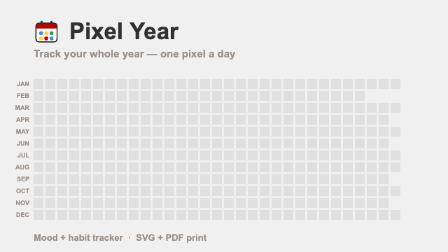
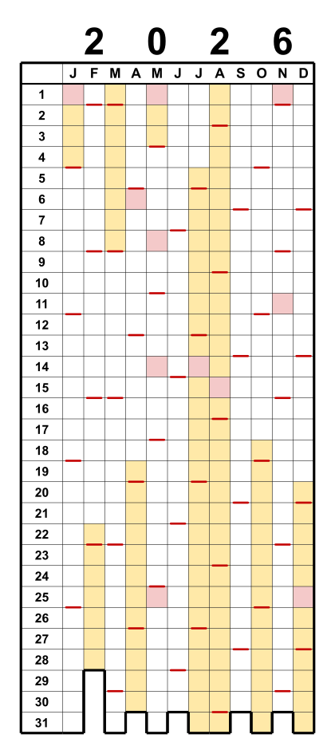
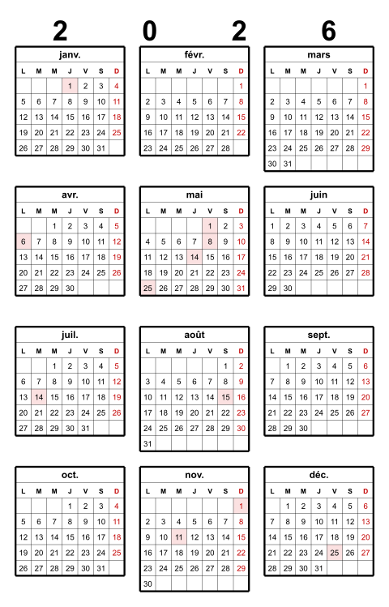
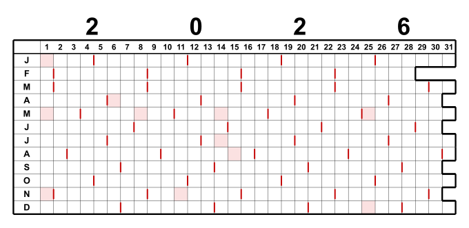

# Pixel Year

🌐 [English](README.md) · [Deutsch](README.de.md) · [Español](README.es.md) · **Français** · [Italiano](README.it.md) · [日本語](README.ja.md)

▶️ **[Essayer en ligne](https://theingof.github.io/pixel-year/)** — fonctionne dans le navigateur, sans installation.

🖥️ **Interface de l'app** en 27 langues : 🇪🇺 toutes les langues de l'UE · 🇳🇴 · 🇯🇵

> **Idea 100% human · Code 95% LLM**

*Calendrier annuel en grille — « Year in Pixels ».*

Colonnes = mois (J–D), lignes = jours 1–31. Vous coloriez les cases — un « Year in Pixels »
classique. Un trait coloré marque chaque dimanche ; le contour inférieur en escalier
suit les jours réels de chaque mois. En option, on peut colorer les jours fériés et les
vacances scolaires. La sortie est à l'échelle, en millimètres (cases de 5 × 5 mm).

> Projet personnel et amateur. Fourni tel quel, sans garantie ni support.

### À quoi ça sert ?

Pixel Year est une grille « Year in Pixels » vierge — une petite case par jour — que vous
remplissez à la main (ou pré-coloriez avec les jours fériés et les vacances scolaires). Une
feuille montre toute l'année d'un coup d'œil. Usages courants :

- **Suivi d'humeur** — coloriez chaque jour selon votre ressenti ; l'année prend forme.
- **Suivi d'habitudes** — marquez les jours de sport, de méditation, de pratique, sans alcool …
- **Journal de voyage / « où étais-je ? »** — coloriez les jours par lieu ou séjour.
- **Planificateur de vacances & congés** — visualisez tous vos jours de congé d'un coup ; avec un
  second calque, comparez deux pays/personnes (vie transfrontalière, famille à l'étranger).
- **Séries & objectifs** — lecture, entraînements, jours sans dépense, jours sans écran.
- **Santé / cycle / sommeil** — une couleur par état.

Imprimez-le à 100 % pour le coller dans un carnet ou l'afficher au mur — ou importez le SVG/PDF
dans une appli de dessin / d'écriture manuscrite sur tablette et remplissez-le au stylet.

## Démarrage rapide

1. Télécharger **`pixel-year.html`**.
2. Double-cliquer pour l'ouvrir dans n'importe quel navigateur — Windows, macOS, Linux.
   Aucune installation.
3. Choisir l'année et les options, puis télécharger le **SVG** ou le **PDF**
   (trois calendriers sur une feuille A4 paysage).

Le reste est, on l'espère, explicite.

Tout fonctionne hors ligne dans le navigateur. Seules les vacances scolaires sont
récupérées en ligne (API OpenHolidays).

## Fonctionnalités

- **Calendrier en grille :** colonnes = mois, lignes = jours 1–31 ; le contour inférieur
  en escalier suit les jours valides de chaque mois (les jours absents, comme le 30 février,
  restent ouverts).
- **Marques du dimanche** (ou de n'importe quel jour) sur le bord inférieur de la case.
- **Jours fériés** (rouge) et **vacances scolaires** (jaune) pour **plus de 130 pays**
  (OpenHolidays & Nager.Date ; régions et vacances scolaires selon disponibilité).
- **Sortie :** un **SVG** unique, ou un **PDF A4 paysage** à l'échelle avec trois
  calendriers côte à côte — généré directement dans le navigateur, sans boîte de dialogue
  d'impression, sans logiciel supplémentaire.
- **Personnalisable :** taille des cases, couleurs (dimanche / férié / vacances) et toutes
  les épaisseurs de trait, avec aperçu en direct.
- **Dispositions :** grille de pixels (portrait / paysage) et matrice de mois (3×4 / 4×3,
  vrais mini-calendriers hebdomadaires).
- **Début de semaine** lundi ou dimanche (par défaut selon le pays) ; dimanches en rouge.
- Option pour **masquer l'année**.
- Cases de 5 mm à l'échelle ; les calendriers paysage s'empilent sur A4 et une matrice de
  mois seule s'imprime en A5/A6.

## Impression

Imprimer à **100 % / « Taille réelle »** (et non « Ajuster à la page »), sinon la grille
de 5 mm ne correspond plus.

## Outil en ligne de commande (archivé)

Un script Python produisait les mêmes calendriers en ligne de commande (traitement par lot,
scripts). Il se trouve désormais dans [`legacy/pixel_year.py`](legacy/pixel_year.py) et
**n'est plus maintenu** — l'outil HTML fait foi. L'utilitaire de catalogue/validation
[`tools/build_catalog.py`](tools/build_catalog.py) reste utilisé.

## International

Choisissez **langue**, **pays** et **région** indépendamment — p. ex. un calendrier de
Hambourg avec des libellés japonais. Noms des mois/jours localisés en six langues
d'interface (EN, DE, ES, FR, IT, JA) ; le jour marqué suit la convention du pays, et une
indication d'ère japonaise (和暦) s'affiche en japonais.

Les données de jours fériés et de vacances proviennent des API **OpenHolidays** et **Nager.Date**.
Lorsqu'un pays ou une région n'a pas de données — ou si vous préférez les vôtres — choisissez
**# Personnalisé** dans la liste des pays et collez vos propres dates (jours uniques ou plages).

**Deux pays sur un même calendrier** — pour la vie transfrontalière ou la planification des
vacances, superposez un second pays/région. Les jours qui se chevauchent sont coupés en diagonale :

## Dispositions

Choisissez une disposition dans le menu **Disposition** (Layout) :

- **Grille de pixels** — le classique « Year in Pixels » : mois en colonnes, jours 1–31 en
  lignes. Disponible en **portrait** ou **paysage** (transposé : jours en colonnes, mois en
  lignes ; impression empilée sur A4 portrait).
- **Matrice de mois (3×4 ou 4×3)** — douze vrais mini-calendriers mensuels, une vue annuelle
  imprimable. Une seule année s'imprime sur le plus petit format possible (**A5**, voire
  **A6** avec de petites cases) ; deux années tiennent sur un A4.

  
  

## Licence

GNU General Public License v3.0 — voir [LICENSE](LICENSE).

## À propos de l'usage d'un LLM

Réalisé « human-in-the-loop » avec un LLM (voir le badge en haut). C'est tout à fait faisable
avec peu de moyens, sur une formule standard — aucun gaspillage de tokens, juste des tâches
ciblées et bien définies quand on sait ce qu'on veut. Pas besoin de cramer des tokens à la
« big tech ». Le plus gros excès a été le pack d'interface en 27 langues — mais celui-là en
valait la peine. ;)

---

> Les dons sont volontaires et soutiennent uniquement le projet. Ils n'influencent pas la
> priorisation des bogues, des demandes de fonctionnalités ou des demandes d'assistance.
