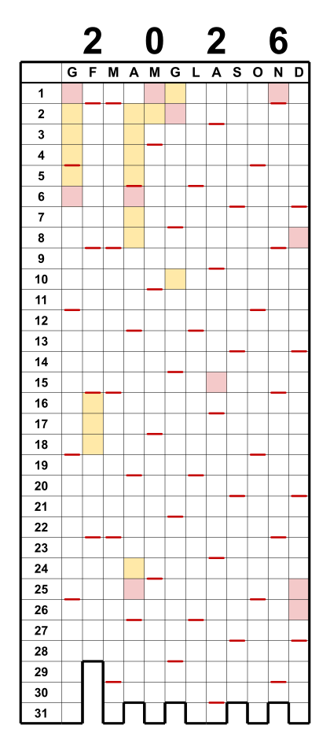
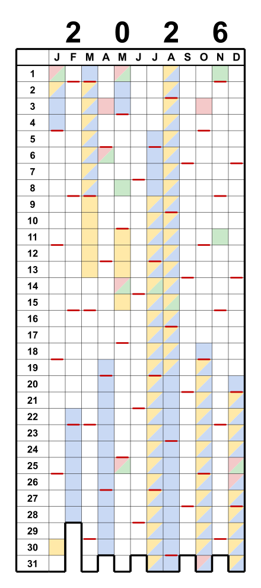

# Pixel Year

🌐 [English](README.md) · [Deutsch](README.de.md) · [Español](README.es.md) · [Français](README.fr.md) · **Italiano** · [日本語](README.ja.md)

🖥️ **Interfaccia dell'app** in 27 lingue: 🇪🇺 tutte le lingue dell'UE · 🇳🇴 · 🇯🇵

> **Idea 100% human · Code 95% LLM**

*Calendario annuale a griglia — “Year in Pixels”.*

Colonne = mesi (G–D), righe = giorni 1–31. Le caselle si colorano — un classico
“Year in Pixels”. Un tratto colorato segna ogni domenica; il contorno inferiore a gradini
segue i giorni reali di ogni mese. È possibile evidenziare festività e vacanze scolastiche.
L'output è in scala, in millimetri (caselle da 5 × 5 mm).

> Progetto personale e amatoriale. Fornito così com'è, senza garanzie né supporto.

## A cosa serve?

Pixel Year è una griglia “Year in Pixels” vuota — una casella per giorno — da riempire a mano
(o pre-colorare con festività e vacanze scolastiche). Un foglio mostra tutto l'anno a colpo
d'occhio. Usi comuni:

- **Tracker dell'umore** — colora ogni giorno in base a come ti sei sentito; l'anno prende forma.
- **Tracker di abitudini** — segna ogni giorno con sport, meditazione, studio, senza alcol …
- **Diario di viaggio / “dov'ero”** — colora i giorni per luogo o viaggio.
- **Pianificatore di ferie e assenze** — vedi tutti i giorni liberi insieme; con un secondo
  overlay confronta due paesi/persone (zona di confine, famiglia all'estero).
- **Serie e obiettivi** — lettura, allenamenti, giorni senza spese, giorni senza schermo.
- **Salute / ciclo / sonno** — un colore per stato.

Stampalo al 100 % per incollarlo su un quaderno o appenderlo al muro — oppure importa l'SVG/PDF
in un'app di disegno / scrittura a mano su tablet e compilalo con il pennino.

## Avvio rapido

1. Scaricare **`pixel-year.html`**.
2. Fare doppio clic per aprirlo in qualsiasi browser — Windows, macOS, Linux.
   Nessuna installazione.
3. Scegliere l'anno e le opzioni, quindi scaricare l'**SVG** o il **PDF**
   (tre calendari su un foglio A4 orizzontale).

Il resto è, si spera, autoesplicativo.

Tutto funziona offline nel browser. Solo le vacanze scolastiche vengono recuperate online
(API OpenHolidays).

## Funzionalità

- **Calendario a griglia:** colonne = mesi, righe = giorni 1–31; il contorno inferiore a
  gradini segue i giorni validi di ogni mese (i giorni mancanti, come il 30 febbraio,
  restano aperti).
- **Segni della domenica** (o di un giorno qualsiasi) sul bordo inferiore della casella.
- **Festività pubbliche** (rosso) e **vacanze scolastiche** (giallo) per **oltre 130 paesi**
  (OpenHolidays & Nager.Date; regioni e vacanze scolastiche dove disponibili).
- **Output:** un singolo **SVG**, oppure un **PDF A4 orizzontale** in scala con tre
  calendari affiancati — generato direttamente nel browser, senza finestra di stampa,
  senza software aggiuntivo.
- **Personalizzabile:** dimensione delle caselle, colori (domenica / festività / vacanze) e
  tutti gli spessori delle linee, con anteprima in tempo reale.

## Stampa

Stampare al **100 % / “Dimensione reale”** (non “Adatta alla pagina”), altrimenti la griglia
da 5 mm non corrisponde più.

## Strumento da riga di comando (archiviato)

Uno script Python produceva gli stessi calendari da riga di comando (elaborazione in blocco,
script). Ora si trova in [`legacy/pixel_year.py`](legacy/pixel_year.py) e **non è più
mantenuto** — lo strumento HTML è l'unica fonte di verità. L'utilità di catalogo/validazione
[`tools/build_catalog.py`](tools/build_catalog.py) è ancora in uso.

## Internazionale

Scegli **lingua**, **paese** e **regione** in modo indipendente — es. un calendario di
Amburgo con etichette giapponesi. Nomi di mesi/giorni localizzati in sei lingue
dell'interfaccia (EN, DE, ES, FR, IT, JA); il giorno evidenziato segue la convenzione del
paese e per il giapponese viene mostrato un riferimento all'era (和暦).

I dati su festività e vacanze provengono dalle API **OpenHolidays** e **Nager.Date**. Dove un
paese o una regione non ha dati — o se preferisci i tuoi — scegli **# Personalizzato** nell'elenco
dei paesi e incolla le tue date (giorni singoli o intervalli).

**Due paesi in un solo calendario** — per la vita di confine o la pianificazione delle vacanze,
sovrapponi un secondo paese/regione. I giorni che si sovrappongono sono divisi in diagonale:

## Licenza

GNU General Public License v3.0 — vedi [LICENSE](LICENSE).

## Sull'uso di un LLM

Realizzato „human-in-the-loop" con un LLM (vedi il badge in alto). È del tutto fattibile con
pochi mezzi, con un piano standard — nessuno spreco di token, solo compiti mirati e ben definiti
quando sai cosa vuoi. Niente „token-burning" da big tech. Lo sfizio più grande è stato il
pacchetto UI in 27 lingue — ma quello ne valeva la pena. ;)

---

> Le donazioni sono volontarie e sostengono esclusivamente il progetto. Non influenzano la
> definizione delle priorità di bug, richieste di funzionalità o richieste di assistenza.
