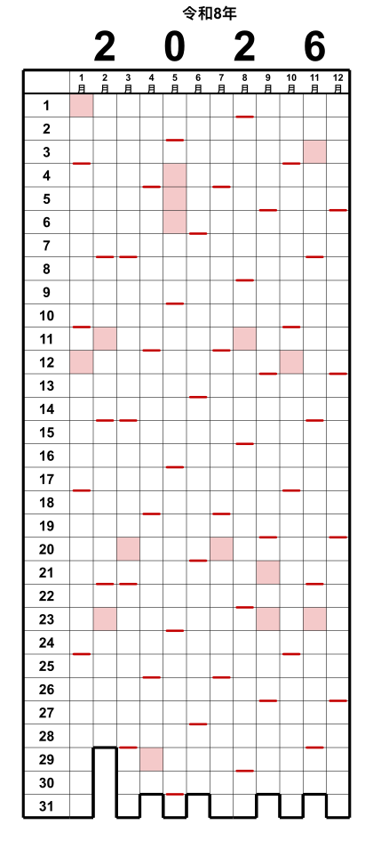

# Pixel Year

🌐 [English](README.md) · [Deutsch](README.de.md) · [Español](README.es.md) · [Français](README.fr.md) · [Italiano](README.it.md) · **日本語**

🖥️ **アプリのUI** は27言語対応：🇪🇺 EUの全言語 · 🇳🇴 · 🇯🇵

> **Idea 100% human · Code 95% LLM**

*グリッド型の年間カレンダー —「Year in Pixels」。*

列 = 月（1〜12 月）、行 = 日（1〜31）。マスを塗りつぶしていく、いわゆる「Year in Pixels」です。
色付きの線が毎週日曜日を示し、下部の階段状の輪郭が各月の実在する日数をなぞります。
祝日や学校休暇に色を付けることもできます。出力はミリメートル単位で実寸（マス 5 × 5 mm）です。

> 個人の趣味プロジェクトです。現状のまま提供され、保証やサポートはありません。

## 何に使う？

Pixel Year は空白の「Year in Pixels」グリッド — 1日1マス — を手で塗っていくものです（祝日や
学校休暇で先に色を付けることもできます）。1枚で1年を一目で見渡せます。よくある使い方：

- **気分トラッカー** — その日の気分で色を塗る。1年が形になっていきます。
- **習慣トラッカー** — 運動・瞑想・練習・禁酒…をした日を記録。
- **旅行／「どこにいた」記録** — 場所や旅行ごとに色分け。
- **休暇・休み計画** — 休みを一度に見渡せる。2つ目のオーバーレイで2か国・2人分を比較（国境地域、海外の家族）。
- **継続・目標** — 読書、トレーニング、無駄遣いゼロの日、画面を見ない日。
- **健康／周期／睡眠** — 状態ごとに1色。

100%で印刷してノートに貼ったり壁に貼ったり — または SVG/PDF をタブレットの手書き／お絵描き
アプリに読み込み、スタイラスで記入することもできます。

## クイックスタート

1. **`pixel-year.html`** をダウンロードします。
2. ダブルクリックして任意のブラウザで開きます — Windows、macOS、Linux。インストール不要。
3. 年とオプションを選び、**SVG** または **PDF** をダウンロードします
   （A4 横一枚にカレンダー 3 つ）。

あとは、おそらく見ればわかります。

すべてブラウザ内でオフライン動作します。学校休暇のデータのみオンラインで取得します
（OpenHolidays API）。

## 機能

- **グリッドカレンダー：** 列 = 月、行 = 日（1–31）。下部の階段状の輪郭が各月の有効な日を
  なぞります（2 月 30 日のような存在しない日は開いたままになります）。
- **日曜日の印**（または任意の曜日）をマスの下端に表示。
- **祝日**（赤）と**学校休暇**（黄）を **130 か国以上** に対応
  （OpenHolidays・Nager.Date、地域と学校休暇は提供がある場合）。
- **出力：** 単一の **SVG**、または実寸の **A4 横 PDF**（カレンダー 3 つを横並び）。
  ブラウザ内で直接生成し、印刷ダイアログも追加ソフトも不要です。
- **カスタマイズ可能：** マスのサイズ、色（日曜 / 祝日 / 休暇）、すべての線の太さを
  ライブプレビュー付きで調整できます。

## 印刷

**100 % /「実際のサイズ」** で印刷してください（「ページに合わせる」ではなく）。
そうしないと 5 mm のグリッドが合わなくなります。

## コマンドラインツール（アーカイブ済み）

同じカレンダーをコマンドラインで生成する Python スクリプトがありました（一括処理、
スクリプト用）。現在は [`legacy/pixel_year.py`](legacy/pixel_year.py) にあり、
**メンテナンスは行われません** — HTML ツールが唯一の正本です。カタログ／検証用の
[`tools/build_catalog.py`](tools/build_catalog.py) は引き続き使用します。

## 多言語・国際対応

**言語**・**国**・**地域**を独立して選べます — 例：日本語ラベルのハンブルク（Hamburg）
カレンダー。月／曜日名は 6 つの UI 言語（EN, DE, ES, FR, IT, JA）にローカライズされ、
強調する曜日は国の慣習に従い、日本語では和暦の表示も行います。

祝日・休暇のデータは **OpenHolidays** と **Nager.Date** の API から取得します。国や地域のデータが
ない場合（または自分のデータを使いたい場合）は、国の一覧で **# カスタム** を選び、自分の日付
（単日または範囲）を貼り付けてください。

**1つのカレンダーに2か国** — 国境地域や休暇の計画向けに、2つ目の国／地域を重ねられます。
重なる日は斜めに分割されます：

## ライセンス

GNU General Public License v3.0 — [LICENSE](LICENSE) を参照してください。

## LLM の活用について

本プロジェクトは LLM を使い「ヒューマン・イン・ザ・ループ」で作りました（上部のバッジ参照）。
標準プランの少ないリソースでも十分可能です — トークンの無駄遣いはなく、何をしたいか分かって
いれば的を絞った明確な指示だけで足ります。大手のようにトークンを浪費する必要はありません。
いちばんの贅沢は27言語のUIパックでしたが、これはやる価値がありました。;)

---

> 寄付は任意であり、プロジェクトの支援のみを目的とします。バグ、機能要望、サポート
> 問い合わせの優先順位には影響しません。
