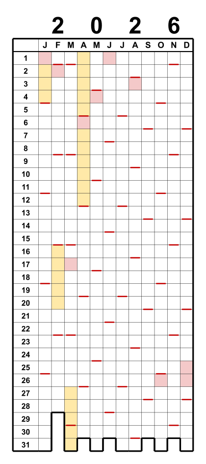
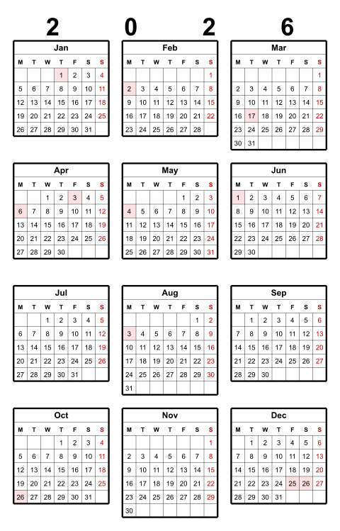
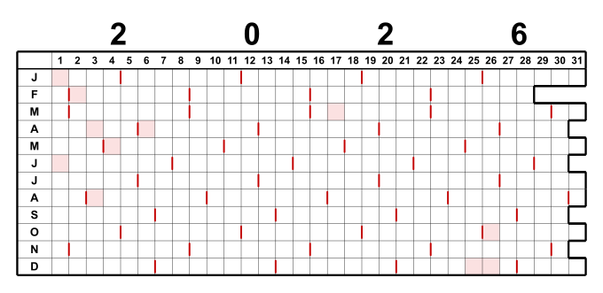

# Pixel Year

🌐 **English** · [Deutsch](README.de.md) · [Español](README.es.md) · [Français](README.fr.md) · [Italiano](README.it.md) · [日本語](README.ja.md)

▶️ **[Try it live](https://theingof.github.io/pixel-year/)** — runs in your browser, no install.

🖥️ **App interface** in 27 languages: 🇪🇺 all EU languages · 🇳🇴 · 🇯🇵

> **Idea 100% human · Code 95% LLM**

*A year-at-a-glance grid calendar — “Year in Pixels”.*

Columns = months (J–D), rows = days 1–31. You fill in the cells — a classic
“Year in Pixels”. A coloured stroke marks every Sunday; the stepped bottom edge
follows the real days of each month. Optionally shade public holidays and school
holidays. Output is true-to-scale in millimetres (5 × 5 mm cells).

> Personal hobby project. Provided as-is, with no warranties or support guarantees.

### What is it for?

Pixel Year is a blank “Year in Pixels” grid — one small box per day — that you fill in by hand
(or pre-shade with public holidays and school vacations). One sheet shows the whole year at a
glance. Popular uses:

- **Mood tracker** — colour each day by how it felt; watch the year take shape.
- **Habit tracker** — mark every day you ran, meditated, practised, stayed sober …
- **Travel / “where was I” log** — shade days by place or trip.
- **Holiday & leave planner** — see all your days off at once; with a second overlay, compare
  two countries/people (cross-border life, family abroad).
- **Streaks & goals** — reading, workouts, no-spend days, screen-free days.
- **Health / cycle / sleep log** — one colour per state.

Print it at 100 % to glue into a notebook or pin on the wall — or import the SVG/PDF into a
drawing / handwriting app on your tablet and fill it in with a stylus.

## Quick start

1. Download **`pixel-year.html`**.
2. Double-click to open it in any browser — Windows, macOS, Linux. No installation.
3. Choose the year and options, then **download the SVG** or the **PDF**
   (three calendars on one A4-landscape sheet).

The rest is hopefully self-explanatory.

Everything runs offline in the browser. Only school-holiday data is fetched online
(OpenHolidays API).

## Features

- **Layouts:** pixel grid (portrait / landscape) and month matrix (3×4 / 4×3,
  real weekly mini-calendars).
- **Grid calendar:** columns = months, rows = days 1–31; the stepped bottom contour
  follows the valid days of each month (missing days like 30 Feb stay open).
- **Sunday marks** (or any weekday) on the lower cell edge.
- **Week start** Monday or Sunday (defaults to the country's convention); Sundays
  shown in red.
- Option to **hide the year**.
- **Public holidays** (red) and **school holidays** (yellow) for **130+ countries**
  worldwide (OpenHolidays & Nager.Date; regions and school holidays where available).
- **Output:** a single **SVG**, or a true-to-scale **A4-landscape PDF** with three
  calendars side by side — generated directly in the browser, no print dialog,
  no extra software.
- **True-to-scale 5 mm cells** throughout; landscape calendars stack on A4, a single
  month matrix prints on A5/A6.
- **Customisable:** cell size, colours (Sunday / holiday / vacation) and all line
  widths, with live preview.

## Printing

Print at **100 % / “Actual size”** (not “fit to page”), otherwise the 5 mm grid no
longer matches the ruler.

## Command-line tool (archived)

A Python CLI produced the same calendars from the command line (batch, scripting).
It now lives in [`legacy/pixel_year.py`](legacy/pixel_year.py) and is **no longer
maintained** — the HTML tool is the single source of truth. The catalogue/validation
helper [`tools/build_catalog.py`](tools/build_catalog.py) is still in use.

## International

Pick **language**, **country** and **region** independently — e.g. a Hamburg calendar with
Japanese labels. Month/day names are localised in six UI languages (EN, DE, ES, FR, IT, JA);
the marked weekday follows each country’s convention, and a Japanese era hint (和暦) is shown
in Japanese.

Holiday and school-holiday data comes from the **OpenHolidays** and **Nager.Date** APIs. Where a
country or region has no data — or you'd rather use your own — choose **# Custom** in the country
list and paste your own dates (single days or ranges).

**Two countries in one calendar** — for cross-border life or holiday planning, overlay a
second country/region. Days that overlap are split diagonally:

## Layouts

Pick a layout under the **Layout** menu:

- **Pixel grid** — the classic “Year in Pixels”: months as columns, days 1–31 as
  rows. Available **portrait** or **landscape** (transposed: days as columns, months
  as rows; prints stacked on A4 portrait).
- **Month matrix (3×4 or 4×3)** — twelve real weekly mini-calendars, a printable
  year-at-a-glance. A single year prints on the smallest page that fits (**A5**, even
  **A6** at small cell sizes); two years share one A4.

  
  

## License

GNU General Public License v3.0 — see [LICENSE](LICENSE).

## On LLM use

Built human-in-the-loop with an LLM (see the badge at the top). It's very doable on a standard
plan with modest means — no token wastage, just targeted, well-scoped prompts when you know what
you want. No big-tech token-burning required. The biggest indulgence was the 27-language UI
pack — but that one was worth it. ;)

---

> Donations are voluntary and solely support the project. They do not influence the
> prioritisation of bugs, feature requests or support enquiries.
